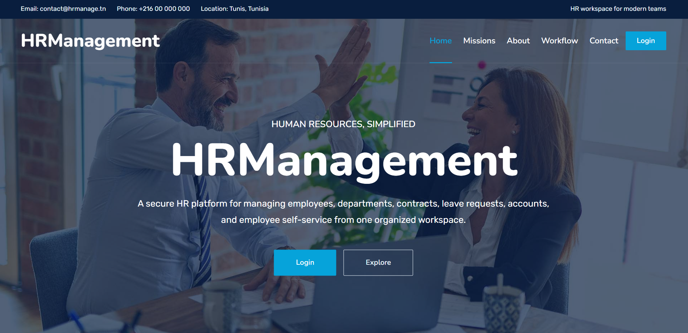

# HRManagement Platform


<br/>



<br/>

Full-stack HR management application built with **ASP.NET Core (.NET 10)**, **Entity Framework Core**, **SQL Server**, and **Angular 18**.

---

## What this project does

- Authenticates users with JWT and BCrypt
- Routes users by role (Admin/Manager → dashboard, Employee → profile)
- Manages employees, departments, contracts, and leaves from the admin dashboard
- Full CRUD UI for **Departments** (`/admin/departments`)
- Lets employees update their profile and change their own password
- **Sends Welcome Emails** automatically containing usernames and generated passwords via Brevo REST API
- Lets users **self-recover their password** without needing admin intervention
- Exposes a documented REST API via Swagger at `/swagger`

---

## Architecture — Onion Architecture

The backend is organized using **Onion Architecture** (folder-based layers within one `.csproj`):

```
HRManagement.API/
│
├── Domain/                       ← Core layer — NO external dependencies
│   ├── Entities/                 Employee, User, Department, Contract, Leave
│   └── Interfaces/               IUserRepository, IEmployeeRepository
│
├── Application/                  ← Use case layer — depends only on Domain
│   ├── DTOs/                     AppDtos.cs (all request/response shapes)
│   └── Interfaces/               ITokenService, ICredentialGeneratorService
│
├── Infrastructure/               ← Technical layer — EF Core, DB, crypto
│   ├── Data/                     AppDbContext.cs
│   ├── Repositories/             UserRepository, EmployeeRepository
│   └── Services/                 TokenService, CredentialGeneratorService
│
└── Presentation/                 ← Thin HTTP layer — only routing & HTTP concern
    └── Controllers/              AuthController, EmployeesController,
                                  DepartmentsController, ContractsController,
                                  LeavesController, MigrateController
```

> **Dependency rule:** outer layers depend on inner layers. Controllers → Application interfaces. Infrastructure implements Application interfaces.

---

## Forgot Password Workflow

The app supports **self-service password recovery** without an email server:

1. User clicks **"Forgot your password?"** on the login page
2. User enters their **username** on the `/forgot-password` page
3. The Angular app calls `POST /api/auth/forgot-password` (no token required)
4. The backend generates a **secure random 12-character password**
5. The new password is hashed with BCrypt and saved into the `Users` table
6. The **temporary password is returned in the response** and displayed in the UI
7. The user copies it, logs in normally, then changes it from their profile page

> The endpoint always returns HTTP 200 regardless of whether the username exists, to prevent username enumeration attacks.

---

## API Endpoints

| Method | Route | Auth | Description |
|--------|-------|------|-------------|
| POST | `/api/auth/login` | None | Log in, get JWT |
| POST | `/api/auth/forgot-password` | None | Self-service password recovery |
| GET  | `/api/auth/me/{employeeId}` | Bearer | Get own user info |
| GET  | `/api/auth/user/{employeeId}` | Admin/Manager | Get user account |
| POST | `/api/auth/reset-password` | Admin/Manager | Admin password reset |
| POST | `/api/auth/create-account` | Admin/Manager | Create user account |
| POST | `/api/auth/change-password` | Bearer | Change own password |
| GET  | `/api/employees` | Bearer | List all employees |
| POST | `/api/employees` | Admin/Manager | Create employee + account |
| GET  | `/api/employees/{id}` | Bearer | Get one employee |
| PUT  | `/api/employees/{id}` | Admin/Manager | Update employee |
| DELETE | `/api/employees/{id}` | Admin | Delete employee |
| PUT  | `/api/employees/{id}/profile` | Bearer (own) | Update own profile |
| POST | `/api/employees/{id}/reset-password` | Admin/Manager | Reset employee password |
| GET  | `/api/departments` | Bearer | List departments |
| GET  | `/api/contracts` | Bearer | List contracts |
| GET  | `/api/leaves` | Bearer | List leaves |

---

## Current workflow

### Login
1. User opens the Angular app at `/`
2. Landing page is shown (Startup2 template)
3. User clicks Login → goes to `/login`
4. Backend verifies BCrypt password, returns JWT + role
5. Angular stores session in `sessionStorage`
6. Guards route: Admin/Manager → `/admin/dashboard`, Employee → `/employee/profile`

### Forgot Password
1. User clicks "Forgot your password?" on the login page
2. User is routed to `/forgot-password`
3. Enters username → clicks Generate
4. If found: temporary password shown on-screen with clipboard copy button
5. User logs in with temp password, then changes it from profile page

### Admin dashboard
1. Dashboard loads employees, departments, contracts, leaves
2. Add employee → creates Employee + User rows + generates credentials
3. Edit → updates employee record
4. Delete → removes employee (blocks if has active subordinates)
5. Reset password → generates new temp password shown once

### Employee profile
1. Employee logs in, profile loads by `employeeId` from JWT
2. Can update name, email, phone
3. Can change password (must know current password)

---

## Backend structure (Onion)

| Layer | Location | Responsibility |
|-------|----------|---------------|
| Domain Entities | `Domain/Entities/` | POCO classes, no framework dependencies |
| Domain Interfaces | `Domain/Interfaces/` | `IUserRepository`, `IEmployeeRepository` |
| Application DTOs | `Application/DTOs/AppDtos.cs` | All request/response shapes |
| Application Interfaces | `Application/Interfaces/` | `ITokenService`, `ICredentialGeneratorService` |
| Infrastructure Data | `Infrastructure/Data/AppDbContext.cs` | EF Core DbContext, relationship config |
| Infrastructure Repos | `Infrastructure/Repositories/` | EF implementations of domain interfaces |
| Infrastructure Services | `Infrastructure/Services/` | JWT token, credential generation, **EmailService (Brevo)** |
| Presentation | `Presentation/Controllers/` | Thin HTTP controllers, delegate to services |

---

## Frontend structure

| Path | Purpose |
|------|---------|
| `src/app/pages/auth/login/` | Login page (Startup2 style) |
| `src/app/pages/auth/forgot-password/` | Self-service password recovery |
| `src/app/pages/landing/` | Public landing page (Startup2) |
| `src/app/pages/admin/dashboard/` | Admin/Manager dashboard (Mazer style) |
| `src/app/pages/admin/departments/`| Full CRUD interface for departments |
| `src/app/pages/employee/profile/` | Employee profile page (Mazer style) |
| `src/app/services/auth.service.ts` | Session management (sessionStorage + JWT) |
| `src/app/services/hr-api.ts` | All API calls (with Bearer auth header) |
| `src/app/guards/auth.guard.ts` | Route protection by role |
| `hr-admin/public/startup2/` | Static Startup2 template assets |
| `hr-admin/public/mazer/` | Static Mazer template assets |

---

## Database model

- `Employee` belongs to an optional `Department`
- `Employee` can have one `Manager` and many `Subordinates` (self-referencing)
- `Employee` can have many `Contracts` and many `Leaves`
- `User` is linked one-to-one with `Employee`

---

## Dev URLs

- **API:** `http://localhost:5037`
- **Swagger:** `http://localhost:5037/swagger`
- **Angular:** `http://localhost:4200`

---

## What is still worth improving

- Split the dashboard into smaller Angular components per section
- Implement the email SMTP setup for the "forgot-password" flow (currently it evaluates locally)
- Add unit tests for: employee creation, password reset, forgot-password, route guards
- Enforce stricter authorization on Departments/Contracts/Leaves endpoints
- Remove the `MigrateController` once all passwords are properly BCrypt-hashed
